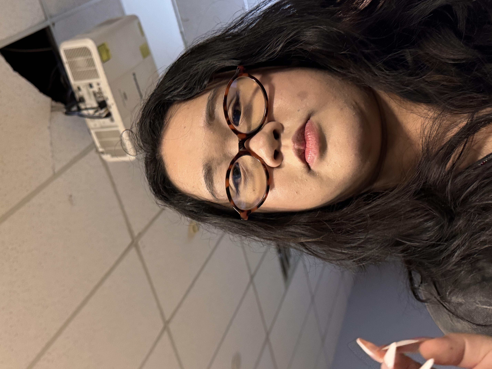
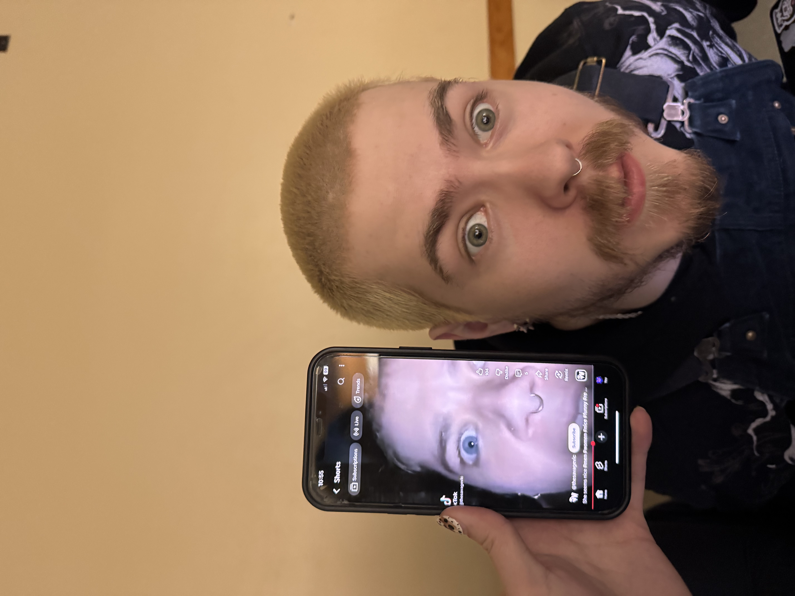
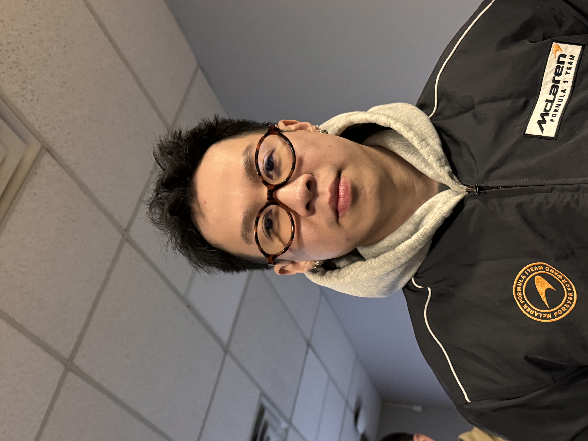
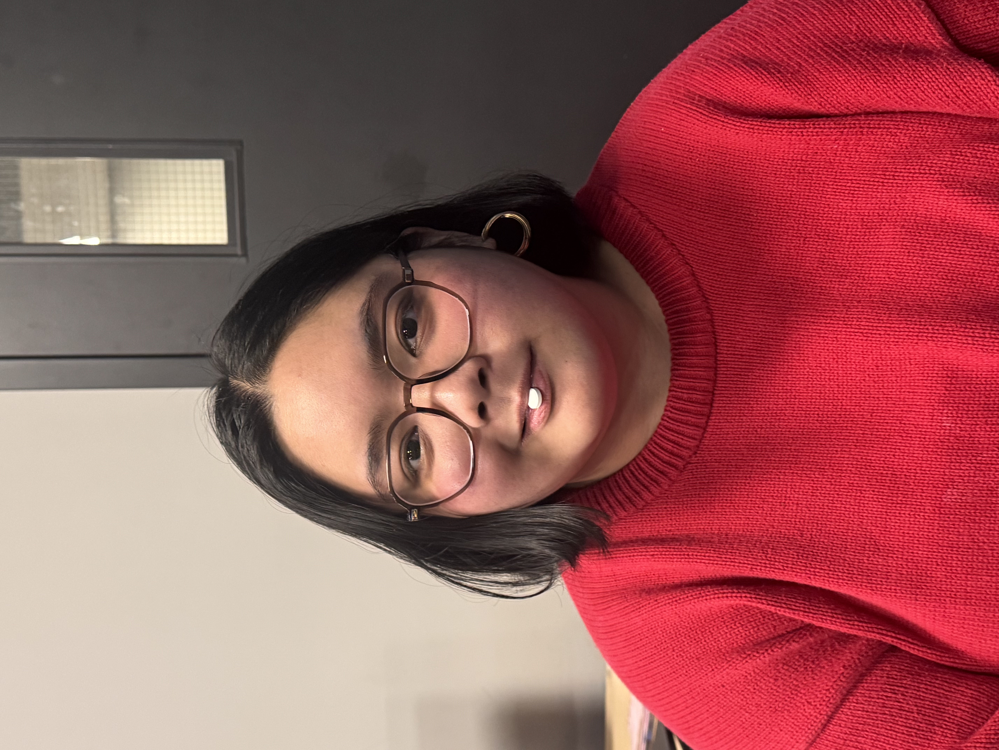
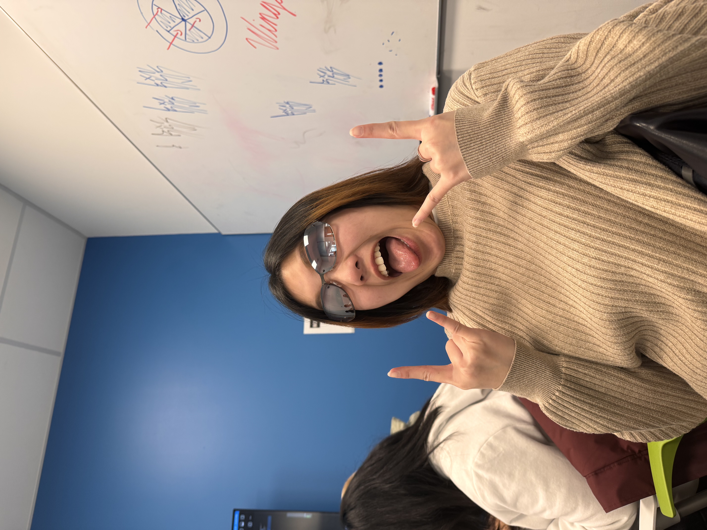
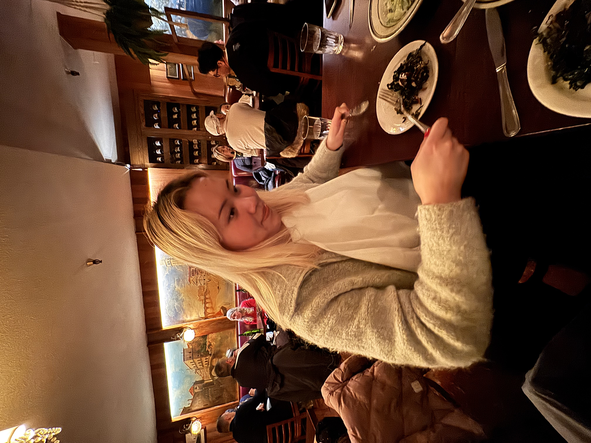
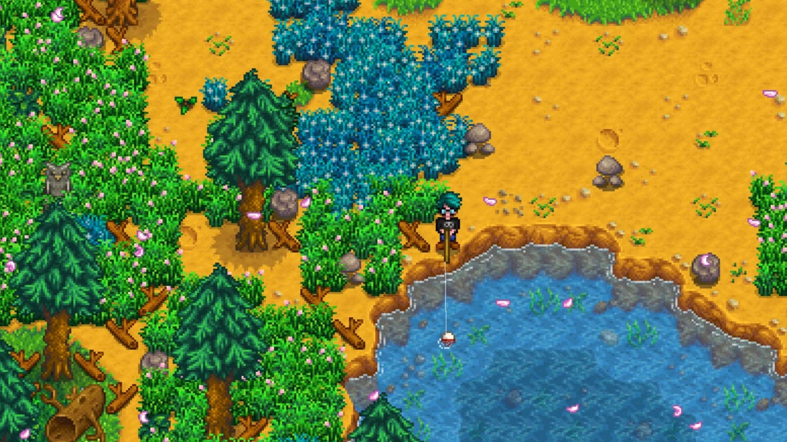

# Fishtopia by Fishtopia.

## Game Team 01- **_Fishtopia_**

## **Athena Zhu**

## **Carson Ferguson**

## **Phillip Ho**

## **Nikka Adrias**

## **Runn Keerativoranant**

## **AND ME!**

We are creating a 2D, 3/4 view pixel art, self-titled fishing game, **Fishtopia**!
The game is set on an island inhibited by cats!! Imagine Stardew Valley, but every character expect the user are cats (because Carson really likes cats 🙄).

The user will play as Finn, who visits the island to sell his late grandfathers fishing store. Just as he arrives to the island, he crashes his boat and is stranded. In order to get off the island, he has to earn local currency by fishing and selling the fish to the cats.

## What I can do.

I will help my team code the HTML and CSS skeleton for our style guide website, implement responsive design so the site works on desktop and mobile and use GitHub.
